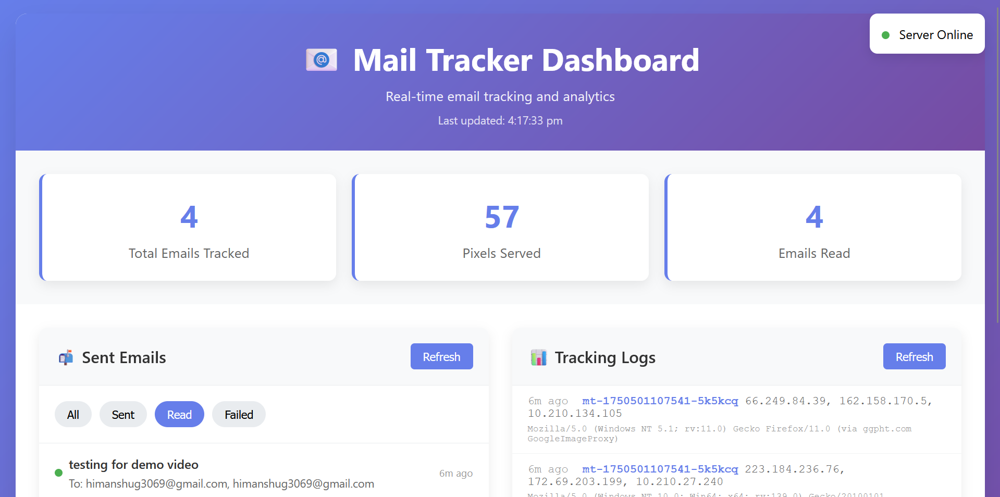

# 📩 Mail Tracker Pro – Firefox Extension

**Mail Tracker Pro** is a powerful email tracking extension for Gmail, designed to provide **real-time notifications** and **detailed analytics** when your emails are opened. Seamlessly integrated with Gmail, this extension offers insight and visibility into your email interactions—right from your browser.

🔗 **[Live Add-on on Firefox](https://addons.mozilla.org/addon/mail-tracker-pro/)**




---

## 🚀 Features

- 🔔 **Real-Time Email Tracking** — Instantly know when your emails are opened.  
- 📊 **Advanced Dashboard Analytics** — Intuitive dashboard with detailed email open statistics.  
- 📥 **Instant Notifications** — Get notified the moment your email is viewed.  
- 💌 **Gmail Integration** — Works directly with Gmail for a smooth experience.  
- 📈 **Comprehensive Tracking Logs** — Access detailed logs and interaction data.

---

## 🛠️ Installation Guide

### 🔧 For Testing (Development Mode)

1. **Download the Extension**
   - Clone or download this repository.
   - Extract all files into a local folder.

2. **Install in Firefox**
   - Open Firefox and navigate to `about:debugging`.
   - Click **"This Firefox"** on the sidebar.
   - Click **"Load Temporary Add-on"** and select `manifest.json`.

3. **Test the Extension**
   - Go to [Gmail](https://mail.google.com).
   - The extension activates automatically.
   - Use the toolbar icon to open the popup.
   - Click “Open Dashboard” to view tracking insights.

---

### 📦 For Distribution

1. **Package the Extension**
   - Zip the following files:
     - `manifest.json`
     - `background.js`
     - `popup.html`, `popup.js`
     - `script.js`
     - `index.html`, `app.js`
     - `icons/` folder
     - `README.md`

2. **Submit to Firefox Add-ons**
   - Visit the [Firefox Add-ons Developer Hub](https://addons.mozilla.org/developers/).
   - Create an account and follow the submission guidelines.
   - Upload your ZIP file and await review.

---

## ⚙️ How It Works

1. **Detection**: Identifies sent emails via Gmail.
2. **Pixel Injection**: Embeds a tracking pixel into outgoing emails.
3. **Real-Time Monitoring**: Records the exact moment an email is opened.
4. **Dashboard Sync**: All tracking events are reflected live on the dashboard.

---

## 🌐 Backend Requirements

This extension relies on a backend server hosted at:

```
https://mail-tracker-k1hl.onrender.com
```

The backend is responsible for:

- User authentication  
- Email data storage  
- Serving the tracking pixel  
- Real-time analytics and logging  

---

## 📁 File Structure

```
Firefox extension/
├── manifest.json          # WebExtension config
├── background.js          # Core background logic
├── popup.html             # Popup UI
├── popup.js               # Popup behavior
├── script.js              # Content script for Gmail
├── index.html             # Main dashboard page
├── app.js                 # Dashboard logic
├── icons/                 # Extension icons
│   ├── icon16.png
│   ├── icon48.png
│   ├── icon128.png
│   └── dashboard.png      # Dashboard screenshot
└── README.md              # Project documentation
```

---

## 🔐 Required Permissions

The extension requests the following:

- `storage` – Save user preferences and session data.  
- `activeTab` – Interact with the currently open Gmail tab.  
- `notifications` – Display desktop alerts.  
- `webRequest` – Monitor Gmail-related traffic.  
- `*://mail.google.com/*` – Access Gmail.  
- `*://mail-tracker-k1hl.onrender.com/*` – Backend communication.  

---

## 🧪 Troubleshooting

### 🛑 Extension Not Working?
- Ensure you’re on [Gmail](https://mail.google.com)  
- Check browser console for errors  
- Refresh the Gmail tab  
- Confirm the backend server is live  

### ❌ Icons Not Displaying?
- Generate icons using `generate-icons.html`  
- Check that all required sizes exist in `icons/`  
- Ensure filenames match those in `manifest.json`  

### 📭 Tracking Not Functioning?
- Confirm you're logged in (check extension popup)  
- Verify backend is operational  
- Inspect network tab in browser dev tools for failed requests  

---

## 👨‍💻 Development & Testing

### 🔄 Local Development
- Set up your backend server (see `backend/README.md`)  
- Update backend URLs in `background.js` and `app.js`  
- Test using Firefox's "Temporary Add-on" mode  

### 🧪 Testing Functions  
Execute these in the browser console:

```js
testPixelTracking(emailId);        // Simulate pixel tracking
testServerHealth();                // Check backend availability
simulateStatusUpdate(emailId, status); // Manually trigger a status change
```

---

## 📬 Support

For issues or queries:  
- Check browser console for logs  
- Confirm all necessary files are present  
- Make sure the backend is online and reachable  

---

## 📄 License

This project is intended for **educational and personal use only**. Ensure compliance with email privacy and tracking regulations applicable in your region.
